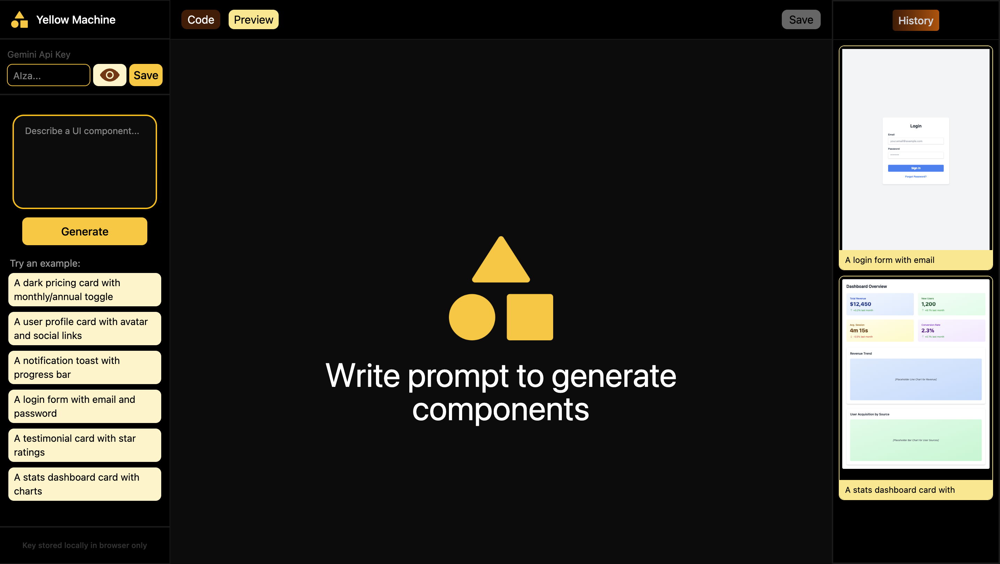

# 🟡 Yellow Machine — AI Component Builder

Describe any UI component in plain text and instantly get
generated code with a live preview, powered by **Gemini API**.



---

## ✨ Features

- 🤖 **AI Generation** — Describe a component, get code instantly via Gemini
- 👁️ **Live Preview** — Switch between Code and Preview tabs in real time
- 📜 **History** — Revisit all your previously generated components
- 💡 **Example Prompts** — One-click suggestions to get started fast
- 🔑 **API Key Storage** — Gemini key stored locally in the browser only

---

## 🛠️ Tech Stack

- **Framework:** React + TypeScript
- **Build Tool:** Vite
- **Styling:** Tailwind CSS
- **AI:** Gemini API
- **Auth/Config:** Firebase

---

## 📦 Installation & Setup
```bash
bun install
bun run dev
```

Create a `.env` file in the root:
```env
VITE_FIREBASE_API_KEY=""
```

> Your Gemini API key is entered directly in the UI and stored in your browser only.

---

## 📁 Project Structure
```
YellowMachine/
├── public/
├── src/
│   ├── components/
│   │   ├── CodeComponent.tsx
│   │   ├── ExampleSuggestion.tsx
│   │   ├── HistoryCard.tsx
│   │   ├── PreviewComponent.tsx
│   │   ├── Slide1.tsx
│   │   ├── Slide2.tsx
│   │   └── Slide3.tsx
│   ├── context/
│   ├── pages/
│   │   └── FrontPage.tsx
│   ├── App.tsx
│   ├── firebase.ts
│   ├── index.css
│   └── main.tsx
├── .env
├── index.html
└── package.json
```
